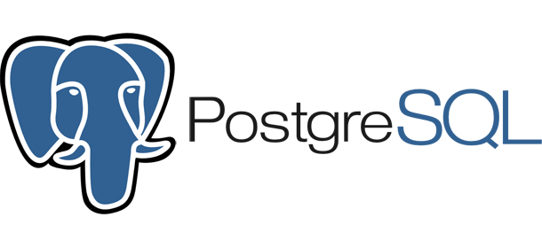
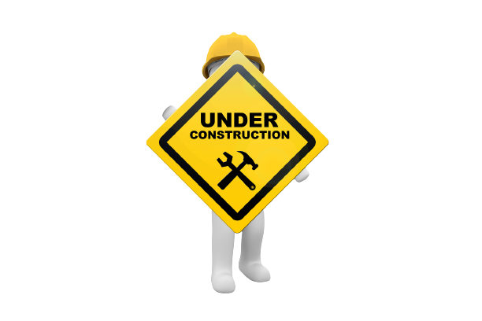

<html>
<head>
	<meta http-equiv="Content-Type" content="text/html; charset=UTF-8" />
  <link rel="stylesheet" href="assets/styles/style.css">        
</head>
<body>
<section id="banner">
  
</section>
<section id="aboutme">
<h1 align="center">About Me</h1>
  

   Hello! My name is Silas, I'm 22 years old, and I've been passionate about technology for as long as I can remember. I've been working in IT since 2016, and since 2019, I've been focused on software development.

In 2019, I started my studies in systems analysis and development at SENAI-BA, and since then, I've been honing my technical skills. I consider resilience in bug fixing, flexibility, teamwork, organization and time management, ability to work under pressure, and leadership as my soft skills.

My goal is to become a highly skilled backend developer and contribute to challenging and innovative projects. If you're looking for a technology professional who is passionate about continuous learning and dedicated to teamwork, I would be an excellent choice. Shall we chat?

  

</section>
<h1  align="center">Principais tecnologias</h1>
<section id="stack-icons" class="stack-box" style="display: flex; justify-content: center;">
        

            

                

                    
                

                

                    
                

                

                    
                

                

                    
                

            

        

</section>

  

</body>
</html>
